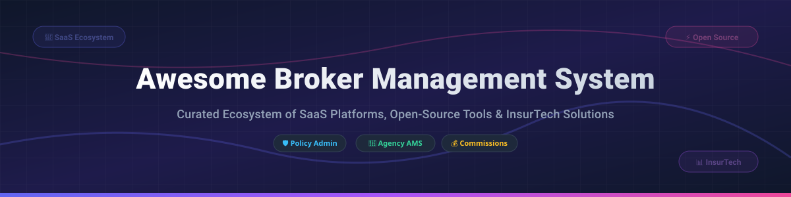

# 🏢 Awesome Broker Management System (AMS) & InsurTech Ecosystem 🛡️



<p center>
  <a href="https://github.com/ishandutta2007/Awesome-Awesome-Awesome"></a><a href="https://discord.gg/jc4xtF58Ve"></a>
  
  
  
  <a href="https://github.com/ishandutta2007"></a>
</p>

## 📊 Top Insurance Broker Management Systems (AMS), Policy Administration & InsurTech Platforms

**A curated, SEO-optimized directory of commercial SaaS products and open-source GitHub software** focused on agency management systems (AMS), insurance policy administration, commission calculation engine, carrier rating integration, ACORD form automation, and claims processing.

**Last updated: September 2026** 📅

---

## 💡 Overview & Ecosystem Insights

This repository tracks top-tier **SaaS platforms** ☁️ and active **open-source repositories** 💻 for **Insurance Broker Management Systems (AMS)**. These tools serve independent insurance agencies, commercial brokers, Managing General Agents (MGAs), and insurance wholesalers by managing customer relationships (CRM), policy lifecycles, carrier quotes, revenue accounting, and claims settlement.

### 🌐 Market Size & Industry Dynamics

> 💡 **Global Insurance Agency Management System (AMS) Market Size:** Valued at approximately **$3.8 Billion (2025)** and projected to reach **$7.2 Billion by 2032**, growing at a CAGR of ~9.4%.
> 
> 🧩 **Market Fragmentation:** The market is **moderately concentrated at the high end** (led by enterprise monoliths like Applied Systems and Vertafore/EZLynx), but remains **highly fragmented across specialized MGAs, specialty commercial brokers, and regional independent agencies**. This fragmentation is driving rapid growth in cloud-native SaaS solutions and API-first open-source microservices.

---

## 📑 Table of Contents

- [🏢 SaaS & Hosted Commercial Platforms](#-saas--hosted-commercial-platforms)
- [🔓 Open-Source GitHub Projects](#-open-source-github-projects)
- [🛠️ Key Functional Modules](#-key-functional-modules)
- [🤝 How to Contribute](#-how-to-contribute)
- [💖 Support & Sponsorship](#-support--sponsorship)
- [📈 Star History](#-star-history)
- [⚠️ Disclaimer](#%EF%B8%8F-disclaimer)

---

## 🏢 SaaS & Hosted Commercial Platforms

Below is a comparative breakdown of leading enterprise Agency Management Systems and InsurTech platforms, sorted by estimated company size / valuation (descending).

| SaaS Platform 🚀 | Target Audience 🎯 | Core Features ⚡ | Starting Tier Price 💵 | Free Tier / Trial Limit ⏳ | Company Valuation / Revenue 💎 |
| :--- | :--- | :--- | :--- | :--- | :--- |
| **[Applied Epic](https://www1.appliedsystems.com/)** | Independent Agencies, MGAs, Global Brokers | Full policy administration, ACORD automation, carrier integration, benefits & P&C accounting | $350 / user / month (base enterprise suite) | 14-Day Enterprise Guided Demo (No free tier) | **$7.0 Billion Valuation** ($1.2B+ Annual Revenue) |
| **[Applied TAM](https://www1.appliedsystems.com/)** | Independent P&C Insurance Agents | Legacy policy management, client tracking, agency accounting, document storage | $150 / user / month | 14-Day Enterprise Demo (No free tier) | **$7.0 Billion Valuation** (Part of Applied Systems) |
| **[EZLynx](https://www.ezlynx.com/)** | Independent Personal & Commercial Agencies | Comparative rating engine, policy admin, customer portal, automated renewals | $169 / user / month (Basic Plan) | 14-Day Free Guided Trial (No free tier) | **$2.0 Billion Valuation** (Acquired by Vertafore) |
| **[Acturis](https://www.acturis.com/)** | UK & European Commercial Brokers, MGAs | Cloud e-trading, multi-carrier rating, policy lifecycle administration, re-insurance | $200 / user / month | 30-Day Sandbox Trial for Brokers (No free tier) | **$1.6 Billion Valuation** (£140M+ Annual Revenue) |
| **[Open GI](https://www.opengi.com/)** | UK & Ireland Insurance Brokers, Wholesalers | Rating engine, e-trading, multi-line policy administration, regulatory compliance | $180 / user / month | 14-Day Sandbox Guided Trial (No free tier) | **$600 Million Valuation** (£60M+ Annual Revenue) |
| **[Novidea](https://www.novidea.com/)** | Global Brokers, MGAs, Specialty Wholesalers | Salesforce-native policy lifecycle management, real-time analytics, multi-currency | $250 / user / month | 14-Day Custom Sandbox Demo (No free tier) | **$500 Million Valuation** ($50M+ ARR) |
| **[HawkSoft](https://www.hawksoft.com/)** | Independent P&C Agencies & Regional Brokers | Workflow management, ACORD form generation, commercial/personal lines CRM | $190 / agency / month | 30-Day Money-Back Guarantee Trial (No free tier) | **$150 Million Valuation** ($30M+ Annual Revenue) |
| **[Veruna](https://veruna.com/)** | Modern Independent Agencies & MGAs | Salesforce-powered AMS, Quote Hero comparative rating, automated ACORD forms | $125 / user / month | 14-Day Interactive Demo (No free tier) | **$75 Million Valuation** ($22.25M Series B Funded) |
| **[BindHQ](https://www.bindhq.com/)** | MGAs, Surplus Lines Wholesalers, Specialty Brokers | Agency management, policy administration, surplus lines tax calculation, carrier portals | $300 / user / month | 14-Day Custom Demo Access (No free tier) | **$40 Million Valuation** ($8M+ ARR) |
| **[Relay Platform](https://www.relayplatform.com/)** | Commercial Lines Brokers, MGA Underwriters | Multi-carrier quoting, placement management, proposal generation, carrier API integration | $99 / user / month | 14-Day Free Trial (Max 5 Quotes) | **$25 Million Valuation** (Acquired by NFP/Aon) |

---

## 🔓 Open-Source GitHub Projects

Open-source agency management software, CRM frameworks, claims engines, and commission processing tools. Sorted by GitHub star count (descending) 🌟.

- **[Quickfire / Openfire](https://github.com/flashvenom/quickfire)** [](https://github.com/flashvenom/quickfire/stargazers) ⭐  
  The leading open-source insurance Agency Management System (AMS) for independent P&C brokers, wholesalers, and MGAs. Built with **ASP.NET Core 10**, **Blazor Server**, Entity Framework Core, FluentUI, and SQL Server/SQLite. Features comprehensive client & policy management, payment & lead API integrations, OpenAI integration for automated data entry, renewal tracking, certificate issuance, Company Manual documentation module, and Forms Library PDF manager.

- **[InsurancePro CRM](https://github.com/prolinkinfo/InsuranceProCRM)** [](https://github.com/prolinkinfo/InsuranceProCRM/stargazers) ⭐  
  Open-source CRM empowering insurance agents to manage clients, policy records, and lead pipelines through an intuitive web interface. Built with JavaScript and Node.js.

- **[Surefire](https://github.com/flashvenom/surefire)** [](https://github.com/flashvenom/surefire/stargazers) ⭐  
  Agency Management System and productivity suite for P&C insurance agencies and brokers, built with Blazor .NET 9 and FluentUI. Shares core lineage with the Quickfire/Openfire ecosystem.

- **[DEMiHAT/IMS (Insurance Management System)](https://github.com/DEMiHAT/IMS)** [](https://github.com/DEMiHAT/IMS/stargazers) ⭐  
  Full-stack Insurance Management System built with Python (Flask) and MySQL (MIT Licensed). Provides web admin & agent portals for client management, policy assignment, claims tracking, payment logging, and agent-customer mapping.

- **[GeoffreyOmollo/insurance-management-system](https://github.com/GeoffreyOmollo/insurance-management-system)** [](https://github.com/GeoffreyOmollo/insurance-management-system/stargazers) ⭐  
  Insurance Policy Management System built with Angular (frontend) and C#/.NET (backend) using PostgreSQL and Dapper ORM. Features coverage rules, exclusion lists, monthly premium deduction tracking, and policy limits.

- **[pavith-raj/Insurance-Policy-Mangagement-System](https://github.com/pavith-raj/Insurance-Policy-Mangagement-System)** [](https://github.com/pavith-raj/Insurance-Policy-Mangagement-System/stargazers) ⭐  
  Insurance Management Database schema designed with MySQL for health, life, and vehicle policy handling, claims recording, sum assured calculations, and premium tracking.

### 🌟 Additional Specialized Open-Source Modules

- **[Digital Claims Management System](https://github.com/ishandutta2007/Awesome-Awesome-Awesome)**  
  Enterprise-grade insurance claims management app built with React, Spring Boot, and AWS S3. Features multi-step claim submissions, document uploads, adjuster approval workflows, and SLA monitoring.

- **[INSure Insurance Sales Management](https://github.com/ishandutta2007/Awesome-Awesome-Awesome)**  
  Insurance sales and lead tracking tool built with React.js, Node.js, and MongoDB. Monitors sales pipelines, policy sales, and agent commissions.

- **[hwg-analytics-hub](https://github.com/ishandutta2007/Awesome-Awesome-Awesome)**  
  Insurance claims and dealer analytics platform built on Supabase PostgreSQL with custom PL/pgSQL functions for revenue growth and performance leaderboards.

- **[Insurance Analytics & ML Platform](https://github.com/ishandutta2007/Awesome-Awesome-Awesome)**  
  Web application for insurance claims analysis with integrated machine learning models for fraud detection. Built with React 18, Python Flask, and Scikit-learn.

- **[Hierarchical Commission Calculation Engine](https://github.com/ishandutta2007/Awesome-Awesome-Awesome)**  
  Production-grade insurance commission platform supporting 4-tier agency hierarchies (Agent → Team Lead → Manager → Director), First Year Commission (FYC) payouts, override bonuses, clawbacks, and an immutable financial ledger. Built with Flask, SQLite, React, and TypeScript.

---

## 🛠️ Key Functional Modules

```
┌─────────────────────────────────────────────────────────────────┐
│              INSURANCE BROKERAGE ARCHITECTURE                   │
├──────────────────┬──────────────────┬───────────────────────────┤
│ Client & CRM     │ Policy Admin     │ Financial & Accounting    │
│  - Contacts      │  - Coverages     │  - FYC Commissions        │
│  - ACORD Forms   │  - Carrier Rates │  - Override Bonuses       │
│  - Submissions   │  - Endorsements  │  - Surplus Lines Tax      │
└──────────────────┴──────────────────┴───────────────────────────┘
```

---

## 🤝 How to Contribute

Contributions are highly appreciated! 💖 To add a new SaaS platform or open-source tool:

1. **Fork** this repository 🍴
2. **Create a feature branch** (`git checkout -b add-new-tool`) 🌿
3. Add your entry in `README.md` following the tabular or bulleted format with accurate pricing/stars 📝
4. **Submit a Pull Request** with a brief rationale 🚀

---

## 💖 Support & Sponsorship

If you find this curated directory helpful for your research, agency, or software project, please consider supporting the project! ⭐

- 🌟 **Star this repository** to help others discover it!
- 🔀 **Fork it** to customize your own stack reference.
- 📢 **Share** with colleagues in the insurance and InsurTech community.
- ☕ **Buy me a coffee / Sponsor**: Support ongoing maintenance on the [GitHub Sponsor Dashboard](https://github.com/sponsors/ishandutta2007).

---

## 📈 Star History

[](https://star-history.dera.page/#ishandutta2007/Awesome-Broker-Management-System&type=date&legend=top-left)

---

## ⚠️ Disclaimer

- This list is **community-curated** for educational and informational purposes only.
- Software selection for insurance operations must adhere to relevant insurance licensing laws, data privacy regulations (GDPR, CCPA, HIPAA), and financial auditing standards.
- Pricing, valuations, and star counts are updated periodically as of **September 2026**.

---

**Made with ❤️ for insurance brokers, agency principals, MGAs, and InsurTech developers worldwide.** 🌍
